# Linux Command Shell Scripting Project

## Overview

This project was completed as part of the **Hands-on Introduction to Linux Commands and Shell Scripting** course, which forms part of the **IBM Data Engineering Professional Certificate** offered by IBM through Coursera.

The objective of this project was to design and implement an automated Linux backup solution using **Bash shell scripting**. The script identifies files modified within the previous 24 hours, compresses them into a timestamped archive, moves the backup to a destination directory, and is then scheduled to execute automatically using **cron**, demonstrating a practical Linux automation workflow.

---

## Technologies Used

- Linux
- Bash Shell Scripting
- Cron
- tar
- chmod
- cp
- date
- pwd
- echo
- Arrays
- Shell Variables

---

## Skills Demonstrated

- Linux command-line navigation
- Bash shell scripting
- Linux automation
- Command-line arguments
- Variable creation and manipulation
- Command substitution
- Timestamp manipulation
- Conditional statements
- Bash arrays
- File system operations
- File compression and archiving
- Linux permissions
- Cron job scheduling
- Backup automation

---

## Repository Structure

```text
linux-command-shell-scripting-project/
│
├── README.md
├── backup.sh
├── lab-instructions.md
│
├── Cheat_Sheets/
│   ├── Cumulative Cheat Sheet.pdf
│   ├── Linux Bash Cheat Sheet - Basics.pdf
│   ├── Module 1 Cheat Sheet.pdf
│   ├── Module 2 Cheat Sheet.pdf
│   └── Module 3 Cheat Sheet.pdf
│
├── 01-Set_Variables.png
├── 02-Display_Values.png
├── 03-CurrentTS.png
├── 04-Set_Value.png
├── 05-Define_Variable.png
├── 06-Define_Variable.png
├── 07-Change_Directory.png
├── 08-YesterdayTS.png
├── 09-List_AllFilesandDirectories.png
├── 10-IF_Statement.png
├── 11-Add_File.png
├── 12-Create_Backup.png
├── 13-Move_Backup.png
├── 15-executable.png
├── 16-backup-complete.png
└── 17-crontab.png
```

---

# Project Objectives

The objective of this project was to develop an automated Linux backup solution capable of:

- Accepting source and destination directories as command-line arguments.
- Identifying files modified within the previous 24 hours.
- Creating a compressed archive using `tar`.
- Moving the archive to a specified destination directory.
- Scheduling the backup process to execute automatically using **cron**. :contentReference[oaicite:2]{index=2}

---

# Tasks Completed

## Task 1 – Set Variables

Stored the source and destination directories using command-line arguments.

<details>
<summary>See solution</summary>


</details>

---

## Task 2 – Display Variables

Displayed the supplied command-line arguments using the `echo` command.

<details>
<summary>See solution</summary>


</details>

---

## Task 3 – Current Timestamp

Generated the current Unix timestamp using the `date` command.

<details>
<summary>See solution</summary>

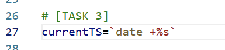

</details>

---

## Task 4 – Backup Filename

Created a timestamped filename for the backup archive.

<details>
<summary>See solution</summary>

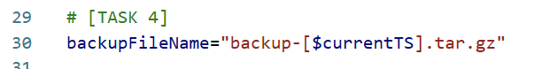

</details>

---

## Task 5 – Current Working Directory

Retrieved the absolute path of the current working directory.

<details>
<summary>See solution</summary>

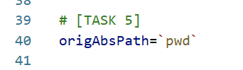

</details>

---

## Task 6 – Destination Directory

Retrieved the absolute path of the destination directory.

<details>
<summary>See solution</summary>

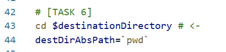

</details>

---

## Task 7 – Change Directory

Changed from the current working directory to the target directory.

<details>
<summary>See solution</summary>

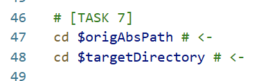

</details>

---

## Task 8 – Calculate Previous Timestamp

Calculated the Unix timestamp representing 24 hours before the current time.

<details>
<summary>See solution</summary>

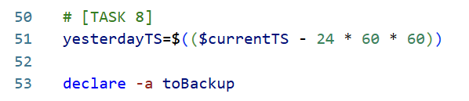

</details>

---

## Task 9 – Iterate Through Files

Used wildcard expansion to iterate through every file and directory within the target folder.

<details>
<summary>See solution</summary>


</details>

---

## Task 10 – Validate Recently Modified Files

Used an `if` statement to determine whether each file had been modified within the previous 24 hours.

<details>
<summary>See solution</summary>

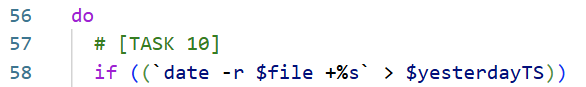

</details>

---

## Task 11 – Store Files in an Array

Stored qualifying files in a Bash array ready for compression.

<details>
<summary>See solution</summary>

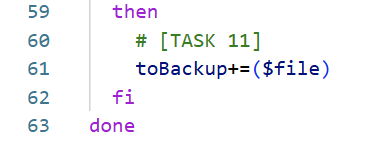

</details>

---

## Task 12 – Create Compressed Backup

Compressed and archived all selected files using the `tar` command.

<details>
<summary>See solution</summary>

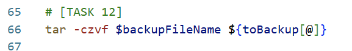

</details>

---

## Task 13 – Move Backup Archive

Moved the completed backup archive to the destination directory.

<details>
<summary>See solution</summary>

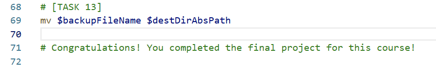

</details>

---

## Task 14 – Save Script

Saved the completed Bash script ready for execution.

---

## Task 15 – Make Script Executable

Granted executable permissions using `chmod` and verified the permissions with `ls -l`.

<details>
<summary>See solution</summary>

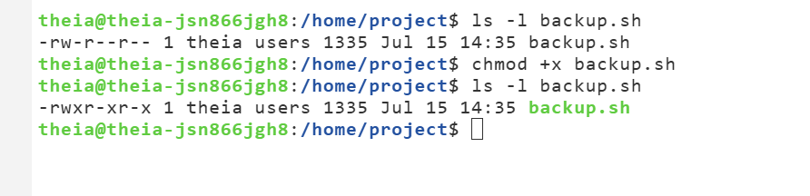

</details>

---

## Task 16 – Test the Backup Script

Executed the completed script and confirmed that the timestamped backup archive was successfully created.

<details>
<summary>See solution</summary>

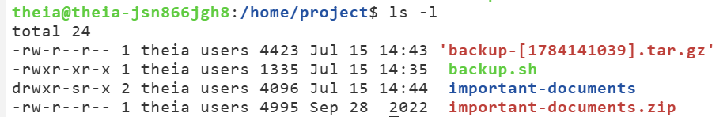

</details>

---

## Task 17 – Schedule Automated Backups

Copied the script to `/usr/local/bin`, configured a cron job, verified automatic execution, and scheduled the backup process to run every 24 hours. :contentReference[oaicite:3]{index=3}

<details>
<summary>See solution</summary>

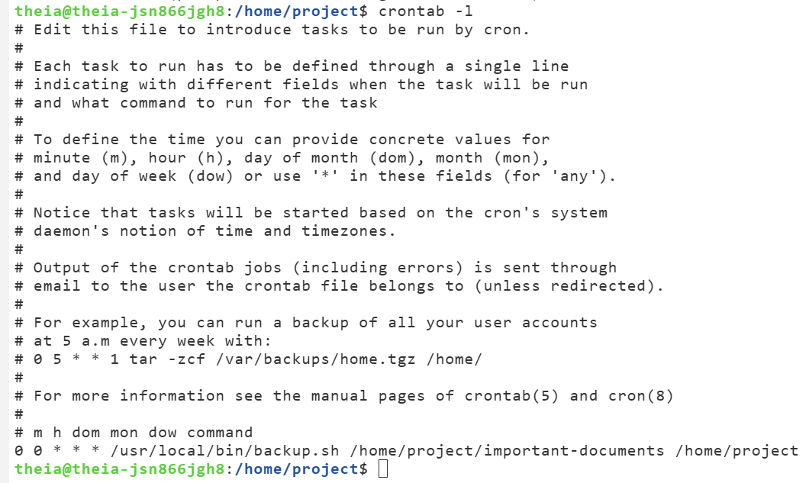

</details>

---

# How the Script Works

The completed Bash script performs the following workflow:

1. Reads the source and destination directories from the command line.
2. Generates the current Unix timestamp.
3. Calculates the timestamp representing 24 hours earlier.
4. Searches the target directory for files modified within the previous day.
5. Stores qualifying files inside a Bash array.
6. Compresses the selected files into a timestamped `.tar.gz` archive.
7. Moves the archive to the destination directory.
8. Supports fully automated execution through **cron** scheduling. :contentReference[oaicite:4]{index=4}

---

# Key Linux Commands Used

| Command | Purpose |
|----------|---------|
| `echo` | Display variable values |
| `pwd` | Display the current working directory |
| `cd` | Change directory |
| `date` | Generate timestamps |
| `tar` | Archive and compress files |
| `chmod` | Modify file permissions |
| `cp` | Copy files |
| `ls -l` | Verify file permissions |
| `touch` | Update file timestamps |
| `cron` | Schedule automated execution |

---

# Learning Outcomes

Through this project I gained practical experience with:

- Bash shell scripting
- Linux command-line operations
- Linux automation
- Variables
- Command substitution
- Arrays
- Conditional statements
- Timestamp calculations
- File handling
- Archive creation
- Backup automation
- Cron scheduling
- Linux permissions
- Shell scripting best practices

---

# References

- IBM Skills Network – **Hands-on Introduction to Linux Commands and Shell Scripting** (Coursera). Successfully completed as part of the **IBM Data Engineering Professional Certificate**.

---

# Author

**David Fernandez**

Data Engineering Portfolio Project