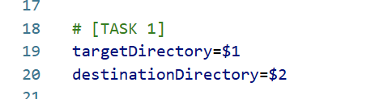
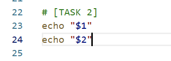

# Final Project: Introduction

### Scenario

Imagine that you are a lead Linux developer at the top-tech company ABC International Inc. ABC currently suffers from a huge bottleneck: each day, interns must painstakingly access encrypted password files on core servers and back up any files that were updated within the last 24 hours. This process introduces human error, lowers security, and takes an unreasonable amount of work.

As one of ABC Inc.'s most trusted Linux developers, you have been tasked with creating a script called `backup.sh` which runs every day and automatically backs up any encrypted password files that have been updated in the past 24 hours.

### Learning Objectives

By completing this final project, you will:
- Demonstrate your advanced shell scripting skills in a real-world scenario
- Apply the knowledge you’ve gained to review and grade technical work.


## Task 0

1. Open a new terminal by clicking on the menu bar and selecting **Terminal**->**New Terminal**:  

2. Download the template file `backup.sh` by running the command below:

```
wget https://cf-courses-data.s3.us.cloud-object-storage.appdomain.cloud/pWN3kO2yWEuKMvYJdcLPQg/backup.sh
```

3. Open the file in the IDE by clicking **File**->**Open** as seen below:
  


then click on the file, which should have been downloaded to your `project` directory:  

  

## About the template script `backup.sh`

  1. You will notice the template script contains comments (lines starting with the `#` symbol). Do __not__ delete these.
  
The ones that look like `# [TASK {number}]` will be used by your grader:


  

  2. Also, please do __not__ modify any existing code above `# [TASK 1]` in the script.
  

## Saving your progress

Your work __will not__ be saved if you exit your session.  

In order to save your progress:  

  1. Save the current working file (`backup.sh`) with `CTRL`+`s` [Windows/Linux], `CMD`+`s` [MAC], or navigate to **File**->**Save** as seen below:  
     
       

  2. Download the file to your local computer by navigating to **File**->**Download** as seen below:  
    
      

  3. Unfortunately, our editor does **not** currently support file uploading, so you will need to copy and paste your work as follows:  
     - To \"upload\" your in-progress `backup.sh` file and continue working on it:  
        1. Open a terminal and type `touch backup.sh`  
        2. Open the empty `backup.sh` file in the editor  
        3. Copy-paste the contents of your locally-saved `backup.sh` file into the empty `backup.sh` file in the editor
  

## Task 1

Navigate to `# [TASK 1]` in the code.

Set two variables equal to the values of the first and second command line arguments, as follows:

1. Set `targetDirectory` to the first command line argument
2. Set `destinationDirectory` to the second command line argument

This task is meant to help with code readability.

<details>
<summary>Click here for Hint</summary>

> The command line arguments interpreted by the script can be accessed via `$1` (first argument) and `$2` (second argument).

</details>

### Solution Task 1:

<details>
<summary>See solution <b>Task 1<b></summary>



</details>

## Task 2

1. Display the values of the two command line arguments in the terminal.

<details>
<summary>Click here for Hint</summary>

> Remember, you can use the command `echo` as a print command.
> - Example: `echo "The year is $year"`

</details>

### Solution Task 2:

<details>
<summary>See solution <b>Task 2<b></summary>



</details>

## Task 3

1. Define a variable called `currentTS` as the current timestamp, expressed in seconds.

<details>
<summary>Click here for Hint</summary>

> Remember you can customize the output format of the `date` command.
>	
> To set a variable equal to the output of a command you can use command substitution: `$()` or `` ` ` ``
>   - For example: `currentYear=$(date +%Y)`

</details>


## Task 4

1. Define a variable called `backupFileName` to store the name of the archived and compressed backup file that the script will create.

  > The variable `backupFileName` should have the value `"backup-[$currentTS].tar.gz"`
  > - For example, if `currentTS` has the value `1634571345`, then `backupFileName` should have the value `backup-1634571345.tar.gz`.
  

## Task 5

1. Define a variable called `origAbsPath` with the absolute path of the current directory as the variable\'s value.

<details>
<summary>Click here for Hint</summary>

> You can get the absolute path of the current directory using the `pwd` command.

</details>


## Task 6

1. Define a variable called `destAbsPath` whose value equals the absolute path of the destination directory.

<details>
<summary>Click here for Hint</summary>

> First use `cd` to go to `destinationDirectory`, then use the same method you used in **Task 5**.

</details>

>Note: Please Note that you can also use the cd "destinationDirectory" || exit which ensures that if the specified directory is incorrect or inaccessible, the script will terminate immediately at this step. This acts as an implicit validation check to confirm that the correct directory is provided before proceeding with further operations. Follow the same for Task 7 .


Friendly reminder to save the work!


## Task 7

1. Change directories from the current working directory to the target directory `targetDirectory`.

<details>
<summary>Click here for Hint</summary>

> `cd` into the original directory `origAbsPath` and then `cd` into `targetDirectory`.

</details>


## Task 8

You need to find files that have been updated within the past 24 hours. This means you need to find all files whose last-modified date was 24 hours ago or less.

To do make this easier:

1. Define a numerical variable called `yesterdayTS` as the timestamp (in seconds) 24 hours prior to the current timestamp, `currentTS`.

<details>
<summary>Click here for Hint</summary>

> Math can be done using `$(())`, for example:
> - `zero=$((3 * 5 - 6 - 9))`
>
>Thus, to get the timestamp in seconds of 24 hours _in the future_, you would use:
> - `tomorrowTS=$(($currentTS + 24 * 60 * 60))`

</details>

In the script, you will notice the line:

```
declare -a toBackup
```

This line declares a variable called `toBackup`, which is an **array**. An array contains a list of values, and you can append items to arrays using the following syntax:

```
myArray+=($myVariable)
```

When you print or `echo` an array, you will see its string representation, which is simply all of its values separated by spaces:

```
$ declare -a myArray
$ myArray+=("Linux")
$ myArray+=("is")
$ myArray+=("cool!")
$ echo ${myArray[@]}
Linux is cool!
```

This will be useful later in the script where you will pass the array `$toBackup`, consisting of the names of all files that need to be backed up, to the `tar` command. This will archive all files at once!


## Task 9

1. In the for loop, use the wildcard to iterate over all files and directories in the current folder.

<details>
<summary>Click here for Hint</summary>

> The asterisk `*` is a wildcard that matches every file and directory in the present working directory.

</details>


## Task 10

1. Inside the `for` loop, you want to check whether the `$file` was modified within the last 24 hours.

>To get the last-modified date of a file in seconds, use `date -r $file +%s` then compare the value to `yesterdayTS`.
>
>`if [[ $file_last_modified_date -gt $yesterdayTS ]]` then the file was updated within the last 24 hours!

2. Since much of this wasn\'t covered in the course, for this task you may copy the code below and paste it into the double square brackets `[[]]`:

```
`date -r $file +%s` -gt $yesterdayTS
```


## Task 11

1. In the `if-then` statement, add the `$file` that was updated in the past 24-hours to the `toBackup` array.
2. Since much of this wasn't covered in the course, you may copy the code below and place after the `then` statement for this task:

```
toBackup+=($file)
```


Friendly reminder to save the work!  


## Task 12

1. After the `for` loop, **compress** and **archive** the files, using the `$toBackup` array of filenames, to a file with the name `backupFileName`.
  

<details>
<summary>Click here for Hint</summary>

> Use `tar -czvf $backupFileName ${toBackup[@]}`.

</details>


## Task 13

Now the file `$backupFileName` is created in the current working directory.

<details>
<summary>Click here for Hint</summary>

> Move the file `backupFileName` to the destination directory located at `destAbsPath`.

</details>

------------

Congratulations! You have now done the coding portion of the lab!

## Task 14

- Save the current working file `backup.sh` with `CTRL`+`s` [Windows/Linux], `CMD`+`s` [MAC] or by navigating to **File**->**Save** as shown below:


- Download the file to your local computer by navigating to **File**->**Download** as shown below:

 <br>


## Task 15

1. Open a new terminal by clicking on the menu bar and selecting **Terminal**->**New Terminal**, as in the image below:


This will open a new terminal at the bottom of the screen as seen below:

 <br>

2. Save the `backup.sh` file you\'re working on and make it executable.

<details>
<summary>Click here for Hint</summary>

> Use the `chmod` command with the correct options.

</details>

3. Verify the file is executable using the `ls` command with the `-l` option:

```sh
ls -l backup.sh
```

## Task 16

1. Download the following `.zip` file with the `wget` command:

```sh
wget https://cf-courses-data.s3.us.cloud-object-storage.appdomain.cloud/IBM-LX0117EN-SkillsNetwork/labs/Final%20Project/important-documents.zip
```

2. Unzip the archive file:

```sh
unzip -DDo important-documents.zip
```

> **Note**: `-DDo` overwrites without restoring original modified date.

3. Update the file's last-modified date to **now**:

```
touch important-documents/*
```

4. Test your script using the following command:

```sh
./backup.sh important-documents .
```

> This should have created a file called `backup-[CURRENT_TIMESTAMP].tar.gz` in your current directory.

## Task 17

1. **Copy**  the `backup.sh` script into the `/usr/local/bin/` directory. (Do ***not*** use `mv`.)

> **Note**: You may need to use `sudo cp` in order to create a file in `/usr/local/bin/`.


2. Test the cronjob to see if the backup script is getting triggered by scheduling it for every 1 minute.

<details>
<summary>Click here for Hint</summary>

```sh
*/1 * * * * /usr/local/bin/backup.sh /home/project/important-documents /home/project
```

</details>

3. Please note that since the Theia Lab is a virtual environment, we need to explicitly start the cron service using the below command:

```sh
sudo service cron start
```

4. Once the cron service is started, check in the directory `/home/project` to see if the `.tar` files are being created. 

5. If they are, then stop the cron service using the below command, otherwise it will continue to create `.tar` files every minute:
 

```sh
sudo service cron stop
```

6. Using crontab, schedule your `/usr/local/bin/backup.sh` script to backup the `important-documents` folder every 24 hours to the directory `/home/project`.

> **Tip**: When you are setting up cron jobs in a real-life scenario, ensure the cron service is running, or start the cron service if needed.


Follow the checklist below to verify that your project meets all requirements before submission.

After completing the final project, you should have saved:

* The complete code of the backup.sh script, with the correct implementation for each of the 13 tasks.

* The terminal output of the file named **backup-permissions**, which shows that the **backup.sh** file has executable permissions.

* The terminal output of the file named **backup-file-check**, which shows the **backup.sh** file in the current directory with the correct name.

* The terminal output of the file named **backup-script-copy**, which shows that the **backup.sh** script has been copied to the **/usr/local/bin/** directory.

* The terminal output of the file named **crontab-schedule**, which shows that the crontab routine is scheduled to run every 24 hours.